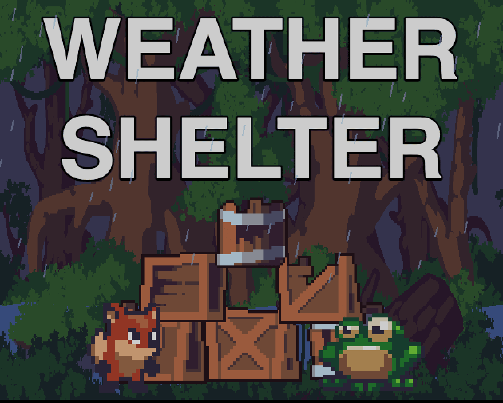

<p align="center">
  
</p>

# Weather Shelter

[](https://github.com/remarkablegames/weather-shelter/releases)
[](https://github.com/remarkablegames/weather-shelter/actions/workflows/build.yml)

☂️ Build shelters before the storm arrives. Can your creations weather the storm?

Weather Shelter is a physics-based puzzle game where you construct shelters to protect animals from the oncoming storm. Stack boxes, planks, and stones to create sturdy structures that can withstand rain, wind, and falling debris. Each level introduces new challenges and materials, testing your engineering skills and creativity.

Play the game on:

- [Wavedash](https://wavedash.com/games/weather-shelter)
- [itch.io](https://remarkablegames.itch.io/weather-shelter)
- [remarkablegames](https://remarkablegames.org/weather-shelter/)

## How to Play

Protect animals from the storm by building shelters out of building materials before the weather strikes.

### Build Phase

- **Drag blocks** onto the animals to construct a shelter around them
- Boxes, stones, and planks behave differently — experiment with stacking them
- Level 1 has no timer; later levels give you a countdown before the storm starts
- Click **Start Storm** when you're ready (or wait for the timer to run out)
- Click **Restart** to restart the current level

### Storm Phase

- Rain falls and damages any animal it hits directly
- Later levels add **wind** that pushes animals and blocks sideways
- Level 3+ drops **debris** that can knock your shelter apart
- Watch each animal's health bar — green is safe, red is critical
- The storm ends on its own; survive it with all animals alive to win

### Tips

- Stack blocks above and around animals to block falling rain
- Use **stones** to anchor structures against wind and debris
- Lean **planks** as sloped roofs to deflect rain off to the sides

### Win / Lose

- **Win**: all animals survive the storm
- **Lose**: any animal's health reaches 0

Progress is saved so you can pick up from where you left off.

## Credits

### Art

- [Sunny Land](https://ansimuz.itch.io/sunny-land-pixel-game-art) by [ansimuz](https://ansimuz.itch.io/)
- [Free Swamp 2D Tileset Pixel Art](https://free-game-assets.itch.io/free-swamp-2d-tileset-pixel-art) by [Free Game Assets](https://free-game-assets.itch.io/)

### Sounds

- [mexican mountain twilight](https://www.subsocials.com/stuff/mexican-mountain-twilight)
- [Thunder Sound](https://pixabay.com/sound-effects/nature-thunder-sound-375727/) by [SoundReality](https://pixabay.com/users/soundreality-31074404/)
- [Fist Punch or kick](https://pixabay.com/sound-effects/fist-punch-or-kick-7171/) by [rcroller](https://pixabay.com/users/freesound_community-46691455/)
- [Mouse click](https://pixabay.com/sound-effects/mouse-click-290204/) by [MatthewVakaliuk73627](https://pixabay.com/users/matthewvakaliuk73627-48347364/)
- [Pop](https://pixabay.com/sound-effects/pop-423717/) by [SoundReality](https://pixabay.com/users/soundreality-31074404/)
- [click button](https://pixabay.com/sound-effects/click-button-131479/) by [666HeroHero](https://pixabay.com/users/666herohero-25759907/)

## Prerequisites

[nvm](https://github.com/nvm-sh/nvm#installing-and-updating):

```sh
brew install nvm
```

## Install

Clone the repository:

```sh
git clone https://github.com/remarkablegames/weather-shelter.git
cd weather-shelter
```

Install the dependencies:

```sh
npm install
```

## Environment Variables

Update the environment variables:

```sh
cp .env .env.local
```

Update the **Secrets** in the repository **Settings**.

## Available Scripts

In the project directory, you can run:

### `npm start`

Runs the game in the development mode.

Open [http://localhost:5173](http://localhost:5173) to view it in the browser.

The page will reload if you make edits.

You will also see any errors in the console.

### `npm run build`

Builds the game for production to the `dist` folder.

It correctly bundles in production mode and optimizes the build for the best performance.

The build is minified and the filenames include the hashes.

Your game is ready to be deployed!

### `npm run bundle`

Builds the game and compresses the contents into a ZIP archive in the `dist` folder.

Your game can be uploaded to your server, [itch.io](https://itch.io/), [newgrounds](https://www.newgrounds.com/), etc.

## Testing

Start a specific level by appending `?level=<number>` to the URL (e.g., `?level=2`):

```sh
open http://localhost:5173/?level=2
```

### Cover Art

Generate cover art by opening the game with `?cover` query param:

```sh
open http://localhost:5173/?cover
```

To export the image, right-click the canvas and select "Save image as..." or use the browser console:

```js
game.canvas.toDataURL('image/png');
```

For best results as a square icon (e.g., 600x600), resize the game canvas in `src/index.ts` before capturing.

## License

[MIT](LICENSE)
